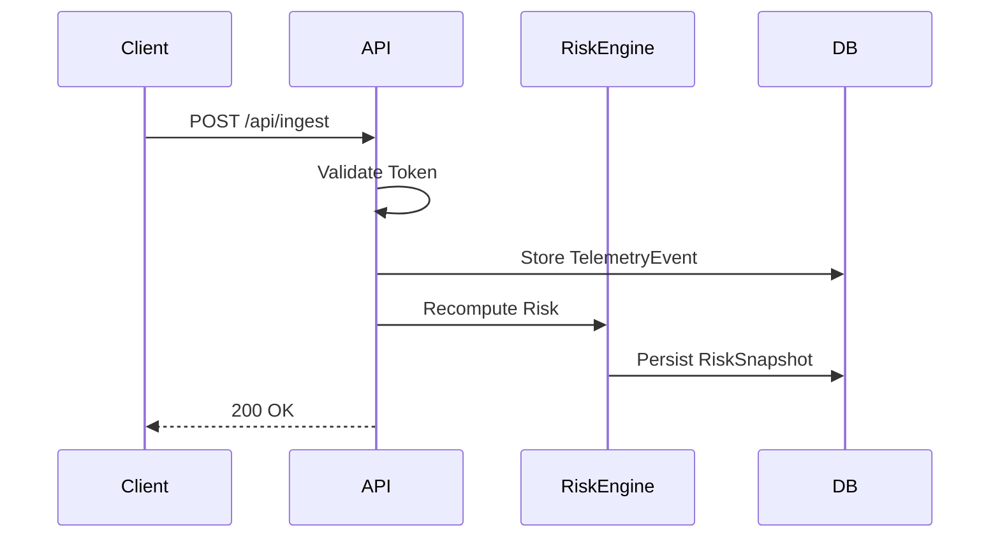
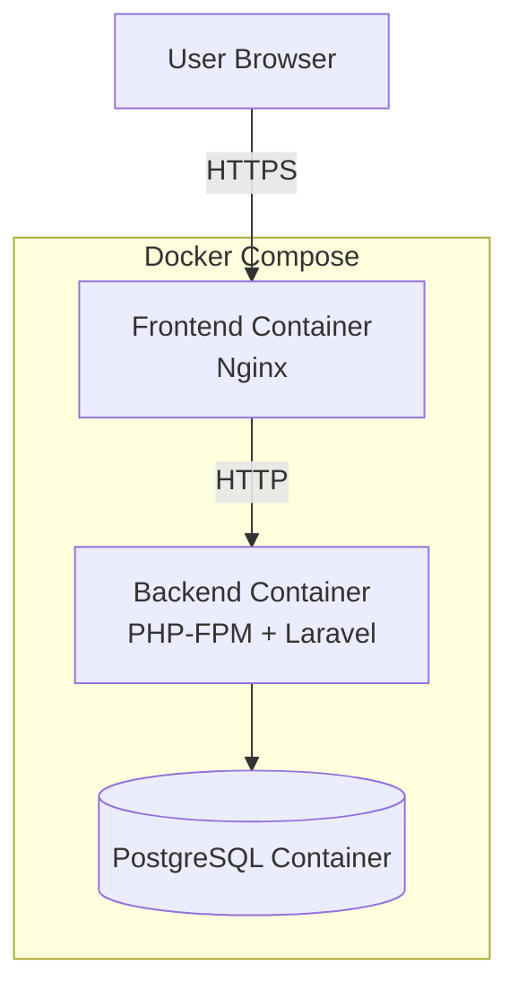

# ARCHITECTURE_VISUAL_MODELS_v1.0

Version: v1.0
Status: Binding Visual Supplement
Project: Operational Security & Observability Hub (OSOH)

------------------------------------------------------------------------

## 1. System Architecture (Layered Model)

```mermaid
graph TD

    subgraph Client Layer
        A[Frontend<br/>React + TypeScript<br/>Strict Mode]
    end

    subgraph Application Layer
        B[Backend API<br/>Laravel]
        D[Risk Engine Service<br/>Deterministic Logic]
    end

    subgraph Persistence Layer
        C[(PostgreSQL)]
        E[(RiskSnapshot)]
        F[(SecurityEvent Log)]
    end

    G[Telemetry Ingestion<br/>X-SITE-TOKEN]

    A -->|HTTPS / JSON API| B
    G -->|Validated Request| B

    B -->|ORM| C
    B --> D
    D -->|Bounded Score 0–100| E
    B -->|Invalid Token Logging| F
````

---

## 2. Security Boundary Model

```mermaid
flowchart TD

    A[External Client] -->|Bearer Token| B[Sanctum Middleware]
    C[Telemetry Sender] -->|X-SITE-TOKEN| D[Ingestion Endpoint]

    B -->|Authenticated| E[Protected Routes]
    D -->|hash_equals Validation| F{Valid Token?}

    F -->|No| G[401 Response]
    G --> H[SecurityEvent Logged]

    F -->|Yes| I[TelemetryEvent Persisted]
```

Security Properties:

* Constant-time comparison
* SHA256 hashed tokens
* Rate limiting (60/min)
* No plaintext secrets
* Logged invalid attempts

---

## 3. Ingestion & Deterministic Recompute Flow



Deterministic guarantees:

* Immediate synchronous recompute
* No async queues
* No stochastic operations
* Same window → same output

---

## 4. Risk Engine Logic Model

```mermaid
flowchart TD

    A[Load Last N Events] --> B[Map Severity → Weight]
    B --> C[Sum Weights]
    C --> D[Apply min(100, total)]
    D --> E[Classify Threshold]
    E --> F[Persist Snapshot]
```

Scoring rule:
Score = min(100, Σ severity_weight)

Severity weights:

* Low = 10
* Medium = 25
* High = 50
* Critical = 75

---

## 5. Deployment Topology



Deployment guarantees:

* Reproducible via docker-compose
* Version-pinned dependencies
* Deterministic build artifacts
* Health endpoint validation (/api/health)

---

END OF DOCUMENT
